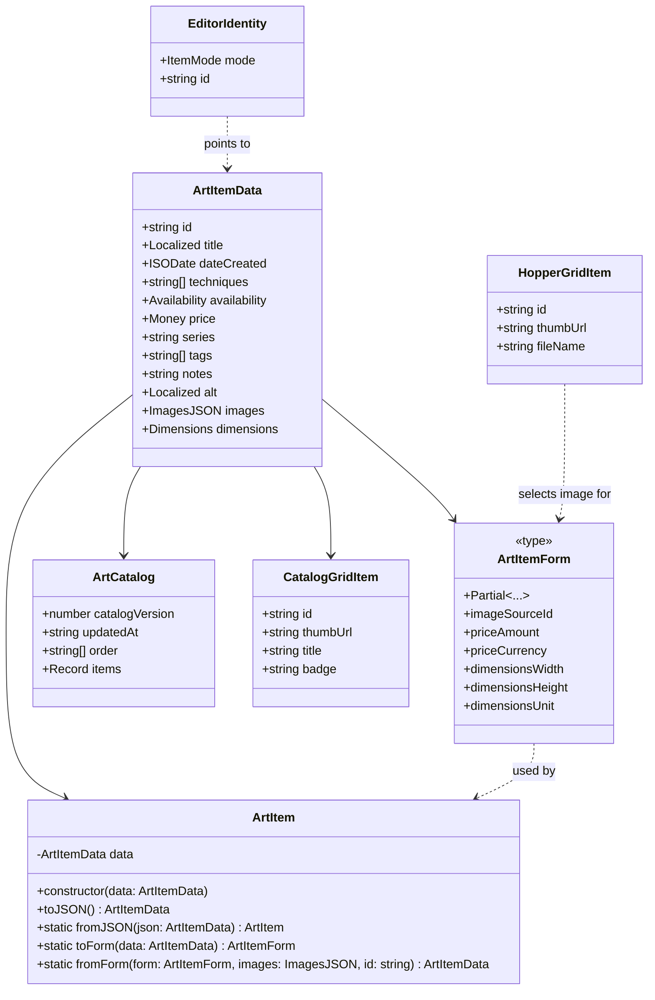

```mermaid
classDiagram
    class ArtItemData {
        +string id
        +Localized title
        +ISODate dateCreated
        +string[] techniques
        +Availability availability
        +Money price
        +string series
        +string[] tags
        +string notes
        +Localized alt
        +ImagesJSON images
        +Dimensions dimensions
    }

    class ArtItem {
        -ArtItemData data
        +constructor(data: ArtItemData)
        +toJSON() ArtItemData
        +static fromJSON(json: ArtItemData) ArtItem
        +static toForm(data: ArtItemData) ArtItemForm
        +static fromForm(form: ArtItemForm, images: ImagesJSON, id: string) ArtItemData
    }

    class ArtItemForm {
        <<type>>
        +Partial<...>
        +imageSourceId
        +priceAmount
        +priceCurrency
        +dimensionsWidth
        +dimensionsHeight
        +dimensionsUnit
    }

    class ArtCatalog {
        +number catalogVersion
        +string updatedAt
        +string[] order
        +Record<string, ArtItemData> items
    }

    class HopperGridItem {
        +string id
        +string thumbUrl
        +string fileName
    }

    class CatalogGridItem {
        +string id
        +string thumbUrl
        +string title
        +string badge
    }

    class EditorIdentity {
        +ItemMode mode
        +string id
    }

    ArtItemData --> ArtItem
    ArtItemData --> ArtCatalog
    ArtItemData --> CatalogGridItem
    ArtItemData --> ArtItemForm
    ArtItemForm ..> ArtItem : used by
    HopperGridItem ..> ArtItemForm : selects image for
    EditorIdentity ..> ArtItemData : points to
```
